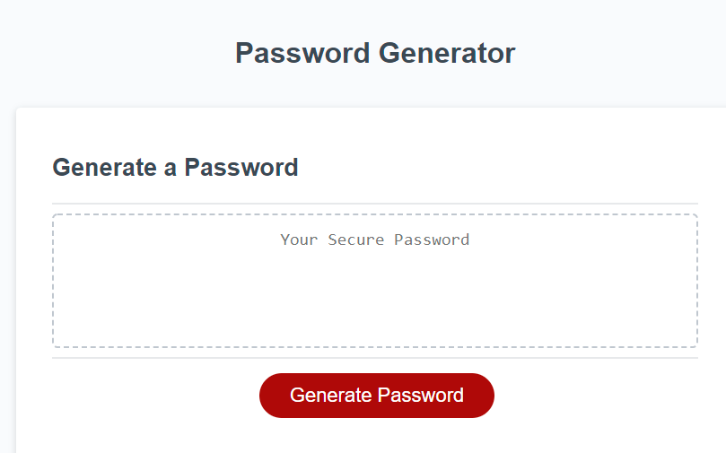
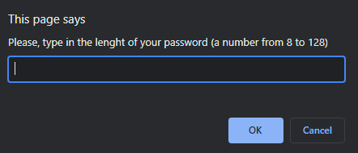
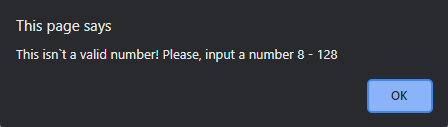
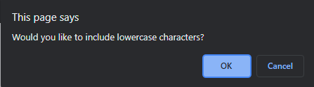
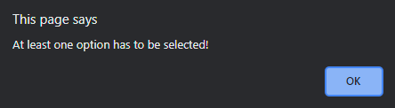
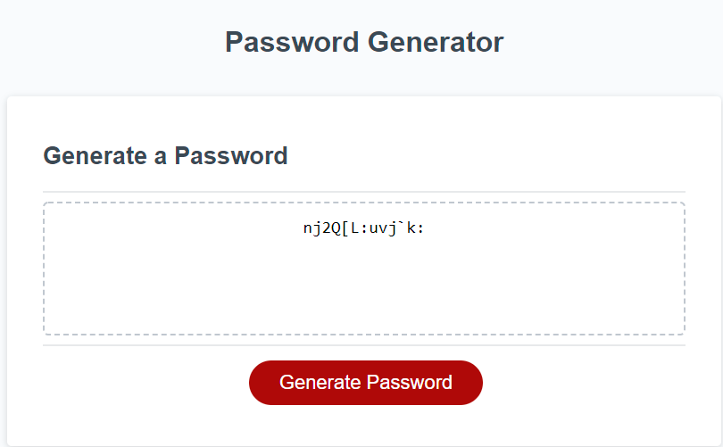

# Password Generator

## Description

This is a Password Generator.
This is a modification of a starter code that is created to enable employees to generate random passwords based on criteria that they’ve selected.
This app runs in the browser and features dynamically updated HTML and CSS powered by JavaScript code.

## Table of Contents
- [Installation](#installation)
- [Usage](#usage)
- [Credits](#credits)
- [License](#license)

## Installation
Current project has been saved in my personal GitHub repository and is currently available for cloning and reviews on:

https://valllerian.github.io/Password-Generator/

## Usage

Main page includes the cliclable button "Generate password" that invokes a prompt:

 

 

First you`re being asked for the length of the password:

 

 

If you in put a number that is not 8-128 you will recieve an alert:

 

 

After a valid number for the character length you select types of characters for the password:

 

 

You can`t skip all the character selection prompts, if so you would recieve an alert:

 

 

If at least one of the options is selected the password will be generated:

 

 

## Credits
Following resources  have been used while working on the project:

1) Array.prototype.concat() explanation from MDN docs:

https://developer.mozilla.org/en-US/docs/Web/JavaScript/Reference/Global_Objects/Array/concat;

2) Explanation of Math.random usage from stackoverflow and w3 schools:

https://stackoverflow.com/questions/60944277/how-do-i-generate-a-non-repeating-random-from-an-array-of-number-in-javascript;

https://www.w3schools.com/js/js_random.asp;

3) List of licenses:

 https://choosealicense.com/;

4) List of password special characters from the OWASP Foundation: 

https://owasp.org/www-community/password-special-characters

## License
Current project is unlicensed. Which means - "Anyone is free to copy, modify, publish, use, compile, sell, or
distribute this software, either in source code form or as a compiled
binary, for any purpose, commercial or non-commercial, and by any
means." (Quote for source #3)

